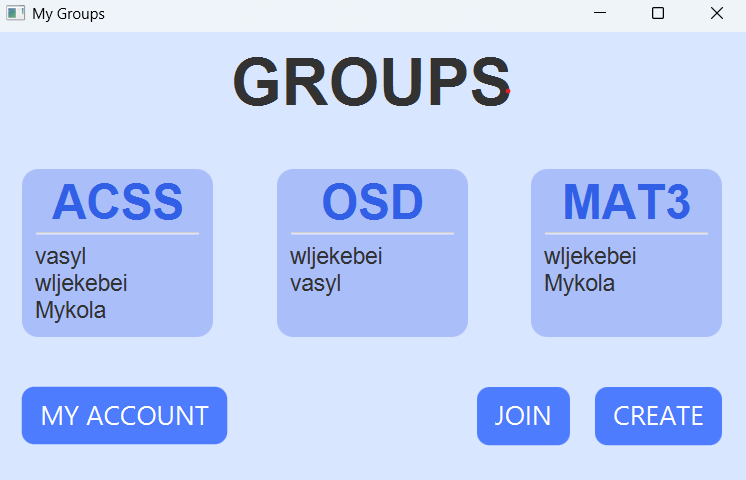
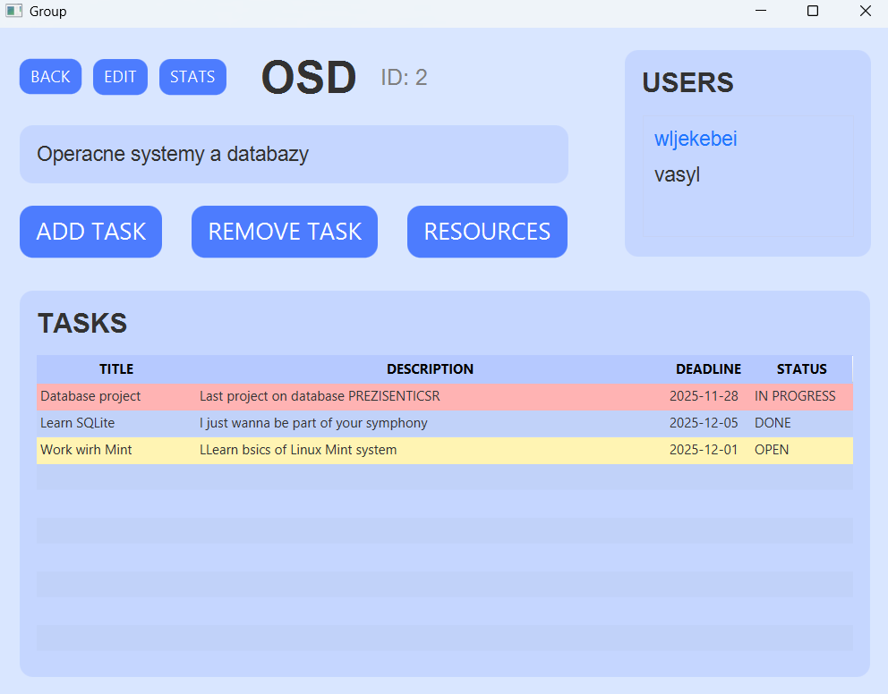
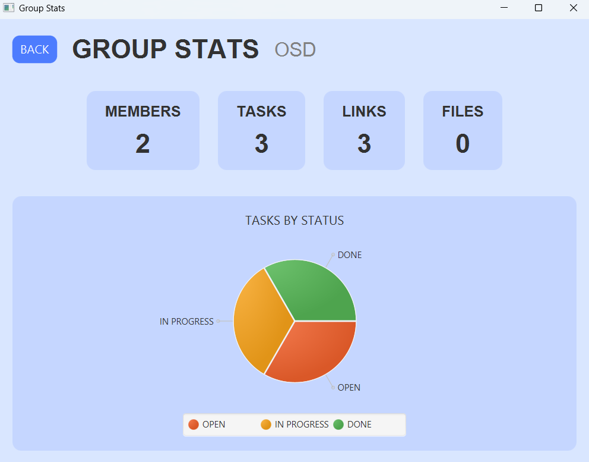
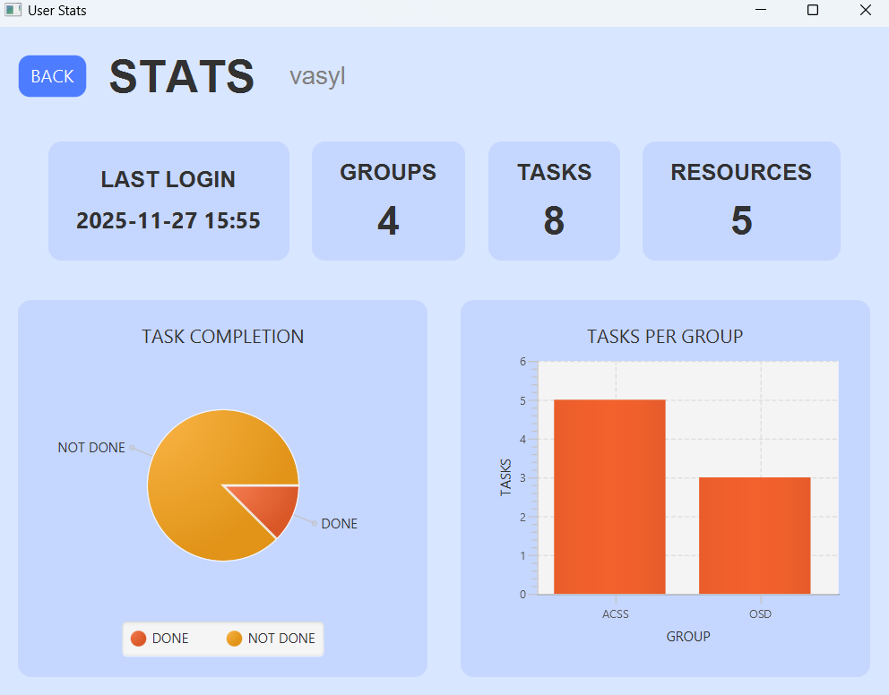

# Collaborative Study Platform

### The application is designed to help users organize group work and make collaboration more efficient. It allows students to create and join groups, manage members, share useful resources (links and files), create tasks with deadlines, and track their progress.

## Architecture Overview

### 1. Frontend (JavaFX Client)

- Provides the user interface

- Handles user interactions

- Sends HTTP requests to the backend

- Maintains a WebSocket connection for real-time notifications

### 2. Backend

- Handles client requests

- Provides REST API

- Sends real-time updates via WebSocket

- Works with the database

- Runs all main logic

### 3. Database (SQLite)

- Stores data: Users, Groups, Tasks, Memberships, Resources, Activity Log

- Defines relationships between tables

## Database model

## REST API & WebSocket
Auth
POST /auth/register — register user
POST /auth/login — login user
Body:

{
"email": "test@mail.com",
"password": "1234"
}

Response:

{
"id": 1,
"email": "test@mail.com",
"name": "John"
}

Users
- GET /users/{id} — get user by ID
- GET /users/{id}/groups — get user groups
- POST /users — create user
- PUT /users/{id} — update user
  
- Body:

{ "name": "New Name" }

Response:

{ "id": 1, "email": "user@mail.com", "name": "New Name" }

Groups
- GET /groups — list all groups
- GET /groups/{id} — get group by ID
- POST /groups — create group (raw entity)
- POST /groups/create — create group (DTO version)
- PUT /groups/{id} — update group
- DELETE /groups/{id}
Response: 200 OK

Group Stats
- GET /stats/group/{id} — get group statistics
  Response:

{
"groupId": 3,
"taskCount": 12,
"memberCount": 5
}

User Stats
- GET /stats/user/{id} — get user statistics
  Response:

{
"userId": 1,
"completedTasks": 24,
"activityScore": 120
}

Memberships (group joining)
- GET /memberships/user/{id} — memberships by user
- GET /memberships/group/{id} — memberships by group
- POST /memberships — add membership
- POST /memberships/join — user joins group
  Body:

{ "userId": 1, "groupId": 3 }

Response:

{ "id": 10, "userId": 1, "groupId": 3 }
- POST /memberships/leave — user leaves group
- DELETE /memberships/group/{gId}/user/{uId} — kick user

Tasks
- GET /tasks/group/{id} — tasks by group
- GET /tasks/creator/{id} — tasks by creator
- POST /tasks — create task
  Body:

{
"groupId": 3,
"title": "New Task",
"description": "abc"
}

Response:

{ "id": 10, "title": "New Task", "status": "OPEN" }
- PUT /tasks/{id} — update task
- DELETE /tasks/{id} — delete task

Resources 

- GET /resources/group/{id} — get resources of group
- POST /resources — create resource
  Body:

{
"groupId": 3,
"uploadedBy": 1,
"title": "Google",
"url": "https://google.com"
}

Response:

{ "id": 7, "title": "Google", "type": "LINK" }
- DELETE /resources/{id} — delete resource
- POST /resources/link — add link
- POST /resources/file — upload file

Activity Log

- GET /activity/user/{id} — logs of user
- POST /activity — add log entry
  Body:

{ "userId": 1, "action": "TASK_CREATED" }

Response:

{ "id": 20, "action": "TASK_CREATED" }

WebSocket Endpoints
-------------------

Connect:
- /ws        (SockJS)
- /ws-native (pure WebSocket)

Subscribe:
- /topic/group/{groupId}
  → real-time notifications for group

Message format (NotificationDTO):
{
"type": "TASK_CREATED | RESOURCE_ADDED | MEMBER_JOINED",
"message": "text",
"groupId": 3
}

Server push:
convertAndSend("/topic/group/{groupId}", payload)
## User Interface

## Challenges and Solutions

The backend required a fast adaptation to Spring Boot and understanding its structure, workflow, and conventions.

Development involved extensive use of documentation, tutorials, and AI tools to efficiently learn necessary concepts.

Implementing key features such as authentication, group management, statistics, file handling, and WebSocket notifications required continuous problem-solving and practical experimentation.

## AI Usage

- Suggesting architectural patterns and best practices

- Optimizing API design and request handling

- Helping fix and organize the WebSocket logic

- Helping to understand Spring Boot